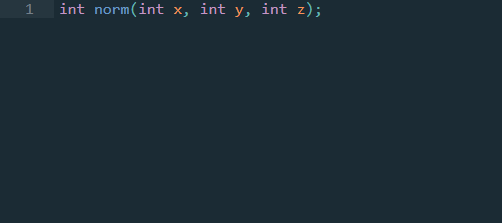
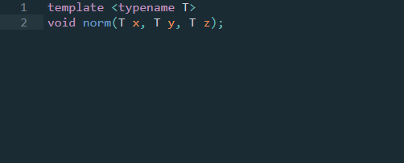
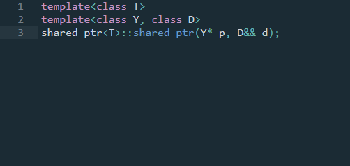

## DoxyDoc

DoxyDoc is a plug-in that allows you to auto-complete doc block comments for C++ using Doxygen.
Related projects are:
 - [PhpDoc](https://github.com/SublimeText/PhpDoc)
 - [DocBlockr](https://github.com/spadgos/sublime-jsdocs)
 - [DoxyDoxygen](https://github.com/20Tauri/DoxyDoxygen)

## Installation

In Sublime Text 3:
 - Use CTRL+SHIFT+P
 - Search `repository`
 - Paste the URL `https://github.com/studentbrad/DoxyDoc`
 - Use CTRL+SHIFT+P
 - Search `package`
 - Find `Enable Package`
 - Enable the package `DoxyDoc`

## Usage

Pressing `/**` and then enter inserts the corresponding documentation.
There are no keyboard shortcuts to memorise.

A file header:

An empty comment:

A basic function:

A templated function:

A complex templated function:

## Notes

This is intended for my own personal use.
